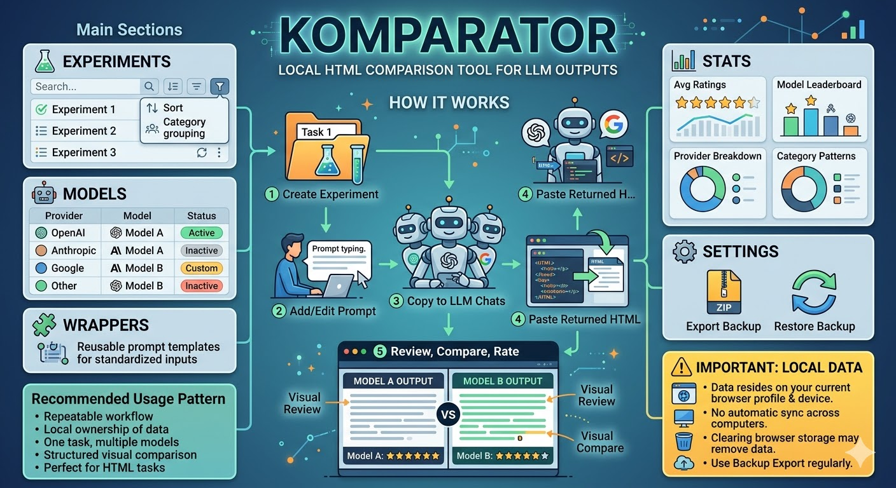

# Komparator

✨ `Komparator` is a local app for comparing HTML results from different LLMs on the same prompt.

It helps you collect outputs, review them visually, compare them side by side, and rate which model did better.

🌍 Try it here: https://llm-komparator.vercel.app/

## What You Can Do

- 🧪 Create experiments for a specific task or prompt
- 🤖 Save results from different models and providers
- 👀 Preview generated HTML directly inside the app
- ⚖️ Compare two results side by side
- ⭐ Rate results on a 1-10 scale
- 🗂️ Organize experiments by category
- 📊 View aggregate stats across your workspace
- 💾 Export and restore your local data

## How It Works

1. Create an experiment.
2. Add or edit the prompt for that experiment.
3. Copy the prepared prompt into one or more LLM chats.
4. Paste the returned HTML results back into Komparator.
5. Review the render, compare outputs, and assign ratings.

## Main Sections

### 🧪 Experiments

Your main workspace.

Here you can:
- browse all experiments
- search and sort them
- group them by category
- open an experiment to review results

### 🤖 Models

Catalog of providers and model variants you use in comparisons.

Use this section to:
- add new models
- keep provider names and colors consistent
- manage active/inactive model entries

### 🧩 Wrappers

Reusable prompt wrappers.

Wrappers help you standardize how prompts are sent to different LLMs. For example, you can enforce a specific output format or add shared instructions around the main task.

### 📊 Stats

Overview of your workspace performance.

You can see:
- how many experiments and results you have
- average ratings
- model leaderboard
- provider breakdown
- category and history patterns

### ⚙️ Settings

Used for backup and restore.

This is the section to use when you want to export your local data or restore it later.

## Important: Your Data Is Stored Locally

🟡 `Komparator` stores data locally in your browser.

That means:
- your experiments, models, wrappers, results, and ratings stay on the current browser profile and device
- data is not automatically synced to another computer
- opening the app in a different browser may show an empty workspace
- clearing browser storage may remove your saved data

If the data matters, use backup export regularly.

## Backup and Restore

### 💾 Export Backup

Go to `Settings` and export your workspace as a ZIP backup.

This is the safest way to keep a copy of:
- experiments
- prompt versions
- models and providers
- wrappers
- saved HTML results
- ratings and notes

### ♻️ Restore Backup

You can restore a previously exported ZIP backup from `Settings`.

Important:
- restore replaces the current local workspace
- use it carefully if you already have data in the current browser

## Good to Know

- 🌐 The app is meant for HTML-based comparison workflows
- 🧾 Results are stored as raw HTML so you can inspect and compare actual renders
- 🔒 The project works without a backend; your workspace stays local unless you export it
- 🖥️ Best experience is on desktop or laptop because preview and side-by-side comparison need space

## Recommended Usage Pattern

- Create one experiment per task
- Keep prompt versions when you iterate on wording
- Save multiple model attempts when stability matters
- Rate results consistently, otherwise stats become less useful
- Export backups before clearing browser data, changing machines, or doing browser cleanup

## In Short

`Komparator` is a private local comparison tool for HTML outputs from LLMs.

It is best when you want a repeatable workflow:
- one task
- multiple model outputs
- visual review
- structured comparison
- local ownership of data
